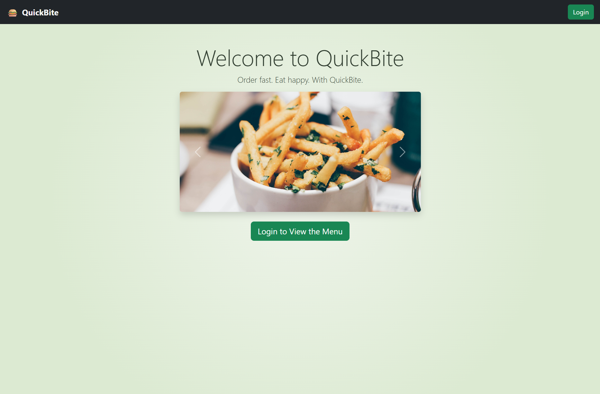
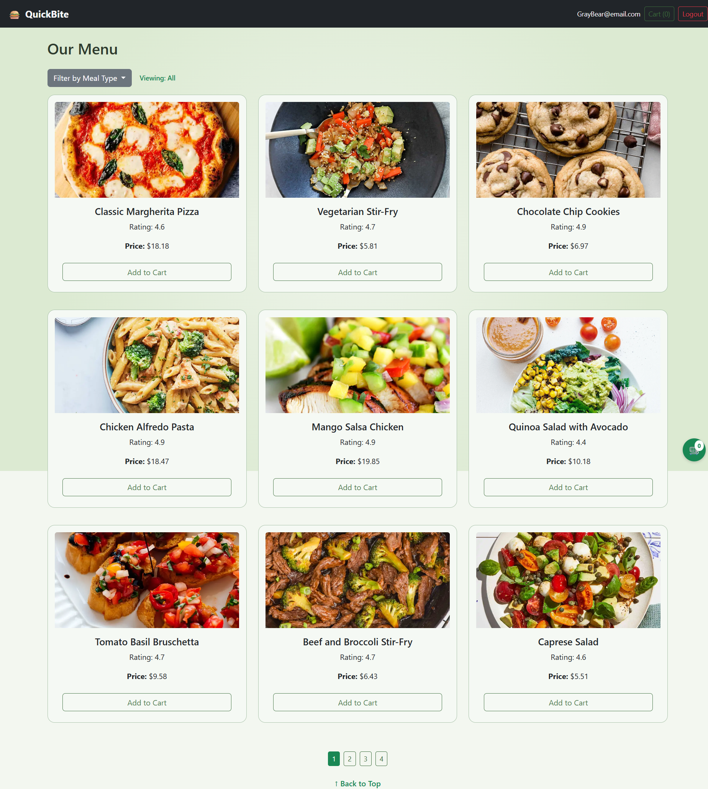
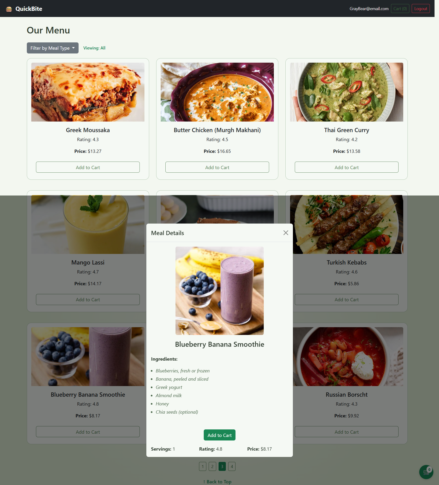
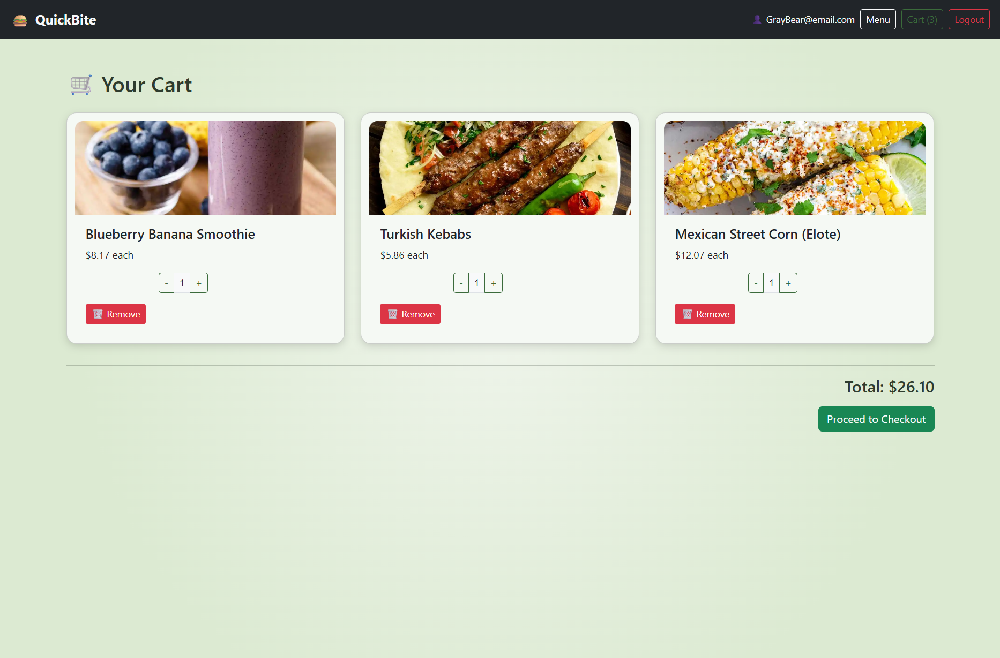
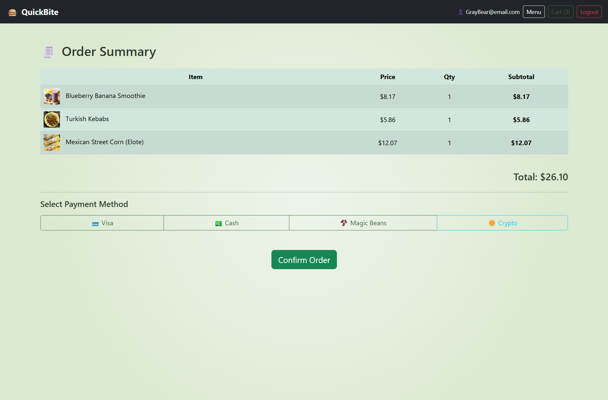
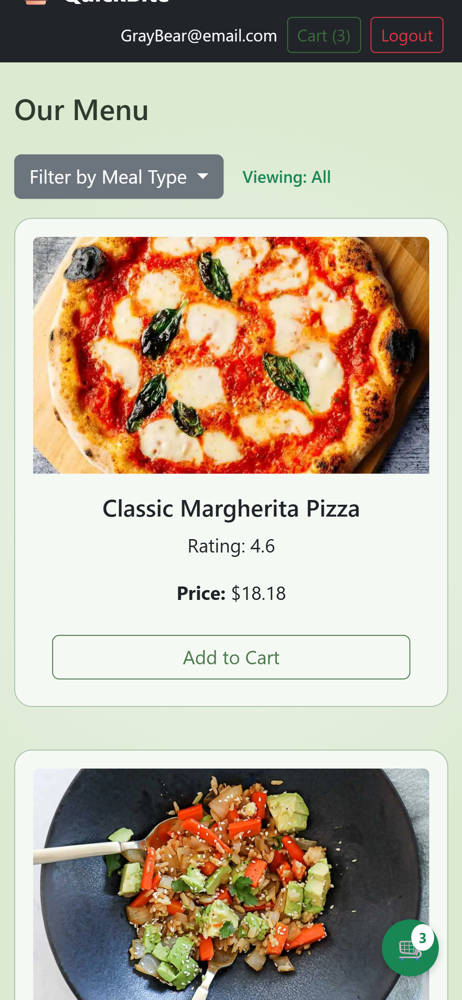
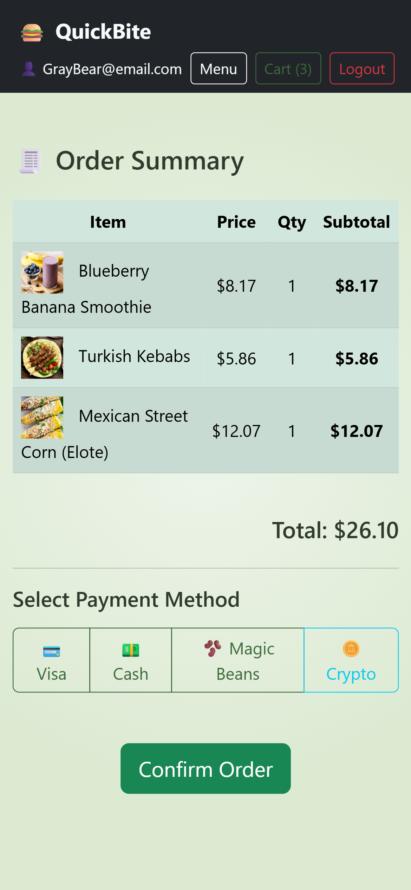

# QuickBite - Food Ordering Web App  
  
  
  
  
  
  

## Description

QuickBite is a responsive, front-end food ordering application designed to simulate a real-world restaurant menu and cart system. I built it as part of my full-stack development journey to strengthen my frontend skills using HTML, CSS, Bootstrap, and JavaScript. It's meant for users who want to quickly browse meals, add items to their cart, and begin a checkout flow. It also serves as a professional portfolio piece to showcase my ability to build dynamic interfaces, integrate with APIs, and use clean, responsive design.

## Live Demo

🚀 Try it live here:  
🔗 [https://quickbite-order.netlify.app](https://quickbite-order.netlify.app)

## Table of Contents

- [Installation](#installation)
- [Usage](#usage)
- [Features](#features)
- [Screenshots 📸](#screenshots-)
- [Technologies Used](#technologies-used)
- [Future Development](#future-development)
- [Author](#author)
- [License](#license)
- [Contributing](#contributing)
- [Image Credits](#image-credits)

## Installation

To run this project locally:

1. Clone the repository:

       git clone https://github.com/SlemJosh/quickbite-food-ordering-app.git

2. Open the folder in your code editor.

3. Launch `index.html` in your browser to begin using the app.

_No build tools or dependencies are required._

## Usage

Browse the food menu, add items to your cart, and proceed to checkout — all within a responsive Bootstrap-powered interface. The app uses a public recipe API to simulate real-world data.

## Features

- Clean and responsive UI with Bootstrap 5.
- Dynamic food cards with images, ratings, servings, and price.
- Accordion filter system by meal category (Breakfast, Lunch, Dinner, Snacks).
- Pagination to control item display.
- Modal pop-ups for detailed item view.
- Add-to-cart options both from card and modal.
- Toast notifications upon adding items.
- Floating cart icon on mobile for quick access.
- Persistent localStorage cart across pages.
- Checkout simulation with confirmation.

## Screenshots 📸

| Page View         | Preview |
|------------------|---------|
| Index Page       |  |
| Menu Page        |  |
| Modal View       |  |
| Cart Page        |  |
| Checkout Page    |  |
| Menu (Mobile)    |  |
| Checkout (Mobile)|  |

## Technologies Used

- HTML5  
- CSS3  
- Bootstrap 5  
- JavaScript (ES6+)  
- DummyJSON API  
- Git and GitHub  
- Netlify for deployment

## Future Development

- Integrate with a real backend (Node/Express) to store user sessions and orders.
- Enhance cart functionality with promo codes or item customization.
- Add registration and user profile support.
- Improve accessibility and keyboard navigation.
- Add loading states and more animations.

## Author

**Joshua Grant Slem**  
GitHub: [SlemJosh](https://github.com/SlemJosh)  
Email: [joshua.slem@gmail.com](mailto:joshua.slem@gmail.com)

## License

This project is licensed under the [MIT License](https://opensource.org/licenses/MIT).

## Contributing

This project was developed independently as part of my training in the SimpliLearn Full Stack MERN program. I used Bootstrap docs, the DummyJSON recipe API, and occasional support tools like ChatGPT to guide problem-solving — similar to referencing Stack Overflow or MDN. The layout and features were designed by me to reinforce frontend concepts covered in class with instructor Akash.

This README was generated using [my own README Generator CLI app](https://github.com/SlemJosh/readme-generator), a tool I built in Node.js to streamline Markdown documentation for projects like this one.

## Image Credits

All carousel images were sourced from [Pixabay.com](https://pixabay.com), which provides royalty-free images under the Pixabay License (free for commercial and noncommercial use, no attribution required — but appreciated).

- **Burger Image**: [Burger by amirali mirhashemian](https://pixabay.com/photos/burger-double-burger-hamburger-food-7323697/)
- **Fries Image**: [French Fries by Engin Akyurt](https://pixabay.com/photos/bowl-french-fries-food-fries-1842294/)
- **Pizza Image**: [Pizza by Engin Akyurt](https://pixabay.com/photos/pizza-food-fast-food-muzarella-1317699/)
